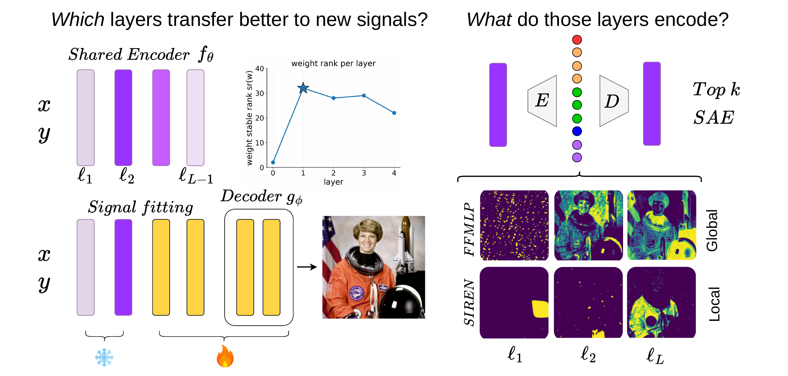
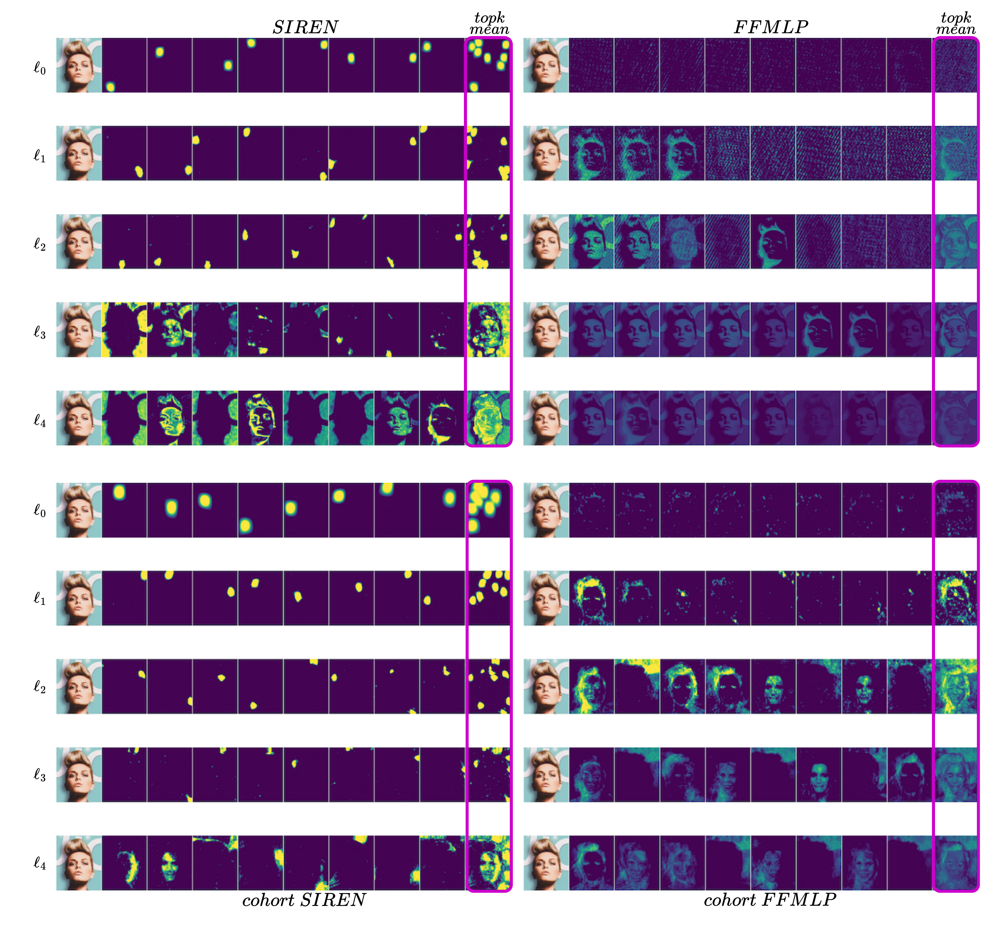

# Welcome

# What Cohort INRs Encode and Where to Freeze Them

This repository accompanies the paper *What Cohort INRs Encode and Where to Freeze Them*.

Experiments for studying what different layers of implicit neural representations (INRs) learn, how well those layers transfer to new signals, and what sparse autoencoders (SAEs) reveal about their internal features.

> [!IMPORTANT]
> This repository is a work in progress. We welcome constructive feedback, questions, and suggestions from researchers working with INRs, representation analysis, transfer learning, and sparse autoencoders.



The current workflow is centered on `strainer_sae_decomposition.ipynb`. The notebook trains a Strainer-style INR with a SIREN backbone on a small image cohort, transfers frozen encoder layers to held-out images, fits TopK SAEs to hidden activations at different encoder depths, and provides SAE atom ablations for probing how individual sparse features affect reconstructed signals.

## Main Questions

- Which shared Strainer encoder layers transfer best to new images?
- Can layer rank diagnostics help identify where transfer is most effective?
- What do global and local SAE features encode at different INR depths?

## SAE Feature Gallery

Example SAE feature maps across INR backbones and encoder depths:



## Setup

Create and activate the conda environment:

```bash
conda env create -f environment.yml
conda activate xp-inrs
```

Launch Jupyter:

```bash
jupyter lab
```

Then open `strainer_sae_decomposition.ipynb`.

## Data

The notebook expects CelebA images under:

```text
data/celeba/img_align_celeba
```

Relative paths are resolved from the repository root. The helper in `data_cohort.py` also checks the sibling path `../sparse_inr/data/celeba/img_align_celeba`, which matches the local experiment setup used while developing the notebook.

## Repository Layout

- `strainer_sae_decomposition.ipynb`: end-to-end Strainer transfer and SAE decomposition notebook.
- `network.py`: minimal local Strainer implementation with Alpine-compatible SIREN-style initialization.
- `strainer_layer_transfer.py`: freeze/reinitialize policy for layer-wise transfer experiments.
- `sae.py`: TopK sparse autoencoder used to decompose INR activations.
- `data_cohort.py`: image cohort loading and coordinate/pixel dataset utilities.
- `metrics.py`: lightweight PSNR and SSIM helpers.
- `figures/`: README and project figures.

## Acknowledgments

The Strainer implementation was adapted from the Alpine project, especially the example notebook:

- Alpine repository: https://github.com/kushalvyas/alpine
- Strainer notebook: https://github.com/kushalvyas/alpine/blob/main/examples/strainer.ipynb

Please acknowledge Alpine when reusing the Strainer-derived code in this repository.
